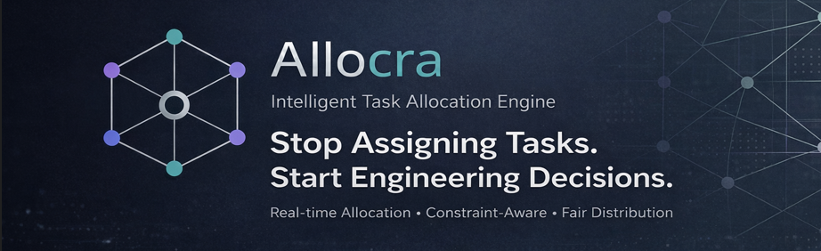

# ⚡ Allocra — Intelligent Task Allocation Engine



### 🧠 From Guesswork → to Data-Driven Allocation

> Allocra is a **constraint-aware decision engine** that assigns tasks based on skill, availability, and workload — not intuition.

---

## 🎯 The Reality

> Teams don’t struggle because of lack of talent.
> They struggle because of **poor task allocation decisions**.

---

## ❌ The Problem

* Tasks assigned without understanding **who is best suited**
* High performers get **overloaded repeatedly**
* Availability is ignored → unrealistic planning
* Decisions rely on **intuition, not logic**

👉 Result: inefficiency, burnout, missed deadlines

---

## 🚨 The Hidden Bottleneck

> Allocation is invisible — but it controls everything.

---

## ✅ The Solution — Allocra Engine

Allocra transforms task assignment into a **structured decision-making system**.

### 🔁 Allocation Pipeline

```text
INPUT → FILTER → SCORE → RANK → ASSIGN → VALIDATE
```

| Stage    | Purpose                          |
| -------- | -------------------------------- |
| FILTER   | Remove invalid candidates        |
| SCORE    | Evaluate using weighted logic    |
| RANK     | Sort candidates by suitability   |
| ASSIGN   | Choose optimal match             |
| VALIDATE | Ensure constraints are respected |

---

## 🧠 Core Intelligence

Each assignment is computed using:

```text
score = skill_match + availability_weight + priority_weight - overload_penalty
```

### Why this matters:

* ⚡ Fast → Real-time decision making
* 🎯 Accurate → Skill-based matching
* ⚖️ Balanced → Prevents overload
* 🚫 Safe → Enforces constraints

---

## 🧪 Example Allocation (Explainability Layer)

```json
{
  "task": "Build API",
  "assigned_to": "Jaswanth",
  "reason": "High Python skill + sufficient availability + lowest workload"
}
```

👉 Not just *what* — but **why**

---

## 🏗️ System Architecture

```text
User Interface (React)
        ↓
API Layer (FastAPI)
        ↓
Allocation Engine (DSA Logic)
        ↓
PostgreSQL Database
```

---

## ⚙️ Capabilities

* Dynamic skill-based matching
* Real-time allocation decisions
* Constraint-aware filtering
* Workload balancing system
* Edge-case handling

---

## 🖥️ Product Interface

> Clean UI for managing teams, tasks, and allocations

*(Add screenshots here — this is critical for judges)*

---

## 🔬 Why Allocra Matters

Most systems manage tasks.
Allocra manages **decisions**.

From:

* ❌ manual assignment
  →
* ✅ intelligent allocation engine

---

## 🧰 Tech Stack


---

## 🔮 Future Evolution

* Hungarian Algorithm (optimal assignment)
* ML-based adaptive scoring
* Simulation mode (compare allocations)
* Predictive workload balancing

---

## 🧠 The Bottom Line

> Allocra is not a task manager.

It is a **decision engine for optimizing team performance**.

---

## 👥 Built By

Focused on **system thinking, algorithm design, and real-world usability**

---
